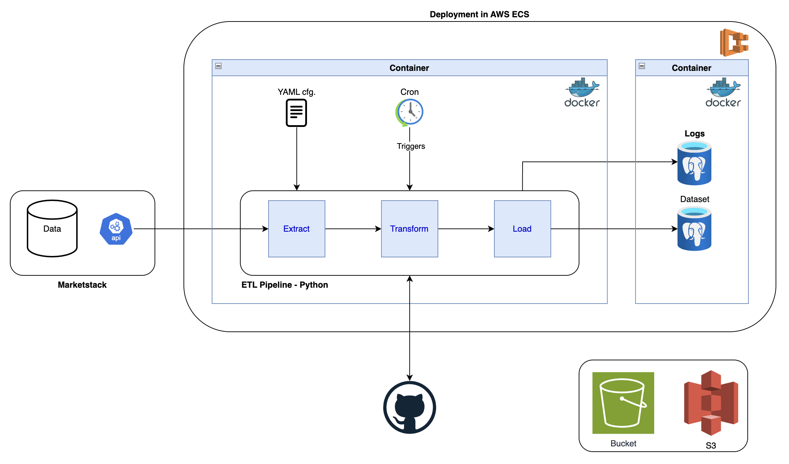

# Data Camp - Project 1

## Project Plan

### Objective
The project will gather stock data from a public API and make it available for consumption by Analysts.

### Consumers & Questions
The output dataset is thoroughly documented and can be easily accessed by authorized Data / Business Analysts either to do ad-hoc queries or connecting the corporate BI tool to provide meaningful insights to Investors. 
For this particular development, we aim to provide a dataset capable of tackling the following questions:
 - Which are the tickers that had the highest growth since Covid
 - What is the average growth for all the tickers during the same time frame
 - For the top tickers, what was their growth over the last 3 months
This will help investors having an idea of the best commodities to invest in.

### Data Sources
Market indicators using the REST API suggested in the project definition will be used: **Marketstack API**.

### Architecture
The architecture that we defined as baseline for this project is:


This can be adapted during the project development considering new inputs and findings.

Please find below a high level description of each of the architecture blocks:
 - To connect to Marketstack, we will be using its REST API (https://marketstack.com/documentation).
 - ETL pipeline will be developed in Python, using OOP principles and structure studied during the course.
 - Girhub will be used for colaboration and code versioning. The Repor has beenn created as well as a branch for each of the developers.
 - The running python code will be later devloyed in a Docker image, ensuring we get a solution that is OS agnostic.
 - Docker image will then been deployed in AWS, using ECS.
 - DWH and Logs will be loaded into a RDS service in AWS.
 - In case of unstructured Data repository need, S3 will be used.


## Data Sources

As previously mentioned, we will retrieve data out of Marketstack public API.  
We will use End-of-Day (EOD) data for understanding tickers evolution over the defined period.  
To enrich the data with some metadata, we will also bring Tickers information.  

### EOD
The information that EOD call responds with is (sample data):
```json
    "data": [
        {
            "open": 129.8,
            "high": 133.04,
            "low": 129.47,
            "close": 132.995,
            "volume": 106686703.0,
            "adj_high": 133.04,
            "adj_low": 129.47,
            "adj_close": 132.995,
            "adj_open": 129.8,
            "adj_volume": 106686703.0,
            "split_factor": 1.0,
            "dividend": 0.0,
            "symbol": "AAPL",
            "date": "2021-04-09T00:00:00+0000"
            },
            [...]
    ]
```

### Ticckers
Tickers call returns (sample data):
```json
    "data": [
        {
            "name": "MICROSOFT CORP",
            "symbol": "MSFT",
            "stock_exchange": {
                "name": "NASDAQ Stock Exchange",
                "acronym": "NASDAQ",
                "mic": "XNAS",
                "country": "USA",
                "country_code": "US",
                "city": "New York",
                "website": "www.nasdaq.com",
                "timezone": {
                    "timezone": "America/New_York",
                    "abbr": "EST",
                    "abbr_dst": "EDT"
                }
            }
        },
        [...]
    ]
```


## ETL

### Extraction
The extraction layer should connect to the REST API from Marketstack and bring data as is to the raw bucket. For simplicity reasons, in this project, Data will be saved in .csv format and manypulated within the python code. In a real workd production environment, probably these files would be within the S3 in order to be accessible by other consumers like a Data Science team.  
Incremental loads should be implemented for the EOD data, ensuring only new data is loaded. The field over which the incremental logic is implemented should be "date". This is particularly important for transactional data (like the EOD) to ensure that every time data is loaded, we only bring the data that we still did not retrieve (imagine a transactional tables with dozens of millions of records being fully loaded every day...).  

### Transformation
Once we have the two -csv files in the format defined above (EOD + Tickers), the transformation step will begin.  
First we will <u>**filter only the necessary fields**</u> from each of the sources:

Filtered EOD:
```json
    "data": [
        {
            "open": ,
            "high": ,
            "low": ,
            "close": ,
            "volume": ,
            "split_factor": ,
            "dividend": ,
            "symbol": "",
            "date": ""
            },
            [...]
    ]
```

Filtered Tickers:
```json
    "data": [
        {
            "name": "",
            "symbol": "",
            "stock_exchange": {
                "name": "",
                "acronym": "",
                "country": "",
                "city": "",
                }
            }
        },
        [...]
    ]
```

After filtering out the unused fileds, we can now move to <u>**rename**</u> them to be more user friendly and formating when necessary.

In terms of formating, since the information is updated on a daily basis, let's <u>**cast date**</u> field to the following format: "YYYY-MM-DD"

Renaming EOD:
```json
    "data": [
        {
            "Opening Price": ,
            "Highest Price": ,
            "Lowest Price": ,
            "Closing Price": ,
            "Volume Transactions": ,
            "Split Factor": ,
            "Dividend": ,
            "Symbol": "",
            "Date": ""
            },
            [...]
    ]
```

Filtered Tickers:
```json
    "data": [
        {
            "Name": "",
            "Symbol": "",
            "stock_exchange": {
                "Stock Exchange Name": "",
                "Acronym": "",
                "Country": "",
                "City": "",
                }
            }
        },
        [...]
    ]
```

The next step should be to <u>**join both files**</u> using "Symbol" field as key to get the ticker transactional and metadata together, making it easier to handle.

It's now time to <u>**implement the defined business rules**</u>, making the data reveal the insight users need to answer their questions:
 1. For all tickers, calculate growth over the period provided: Total Growth = (( Closing Price (initial date) / Closing Price (last date) ) - 1) * 100
    1. Order by growth descending and filter the top 10
 2. Average grwoth for all tickers: Average Growth = Sum(indivisual Ticker Growth) / Count(Tickers) --This value will be the same for all tickers--
 3. For the top 10, calculate growth over the last 3 months (formula similar to the first one, just changing start date): Last Quarter Growth


### Load
There will be two different .csv files to Load into PosgreSQL. Their format is presented below.

EOD + Tickers data:
```json
    "data": [
        {
            "Opening Price": ,
            "Highest Price": ,
            "Lowest Price": ,
            "Closing Price": ,
            "Volume Transactions": ,
            "Split Factor": ,
            "Dividend": ,
            "Symbol": "",
            "Name": "",
            "Date": "",
            "stock_exchange": {
                "Stock Exchange Name": "",
                "Acronym": "",
                "Country": "",
                "City": "",
                }
            },
            [...]
    ]
```

Calculated Data (KPIs) filtered only for the top 10 growing tickers:
```json
    "data": [
        {
            "Symbol": "",
            "Name": "",
            "Total Growth": "",
            "Average Growth": "",
            "Last Quarter Growth": "",
            "stock_exchange": {
                "Stock Exchange Name": "",
                "Acronym": "",
                "Country": "",
                "City": "",
                }
            },
            [...]
    ]
```

## Project Management
We created a Trello for defining and follwoing the tasks:
https://trello.com/b/iWBfj3tv/data-camp-project-1-group-5
