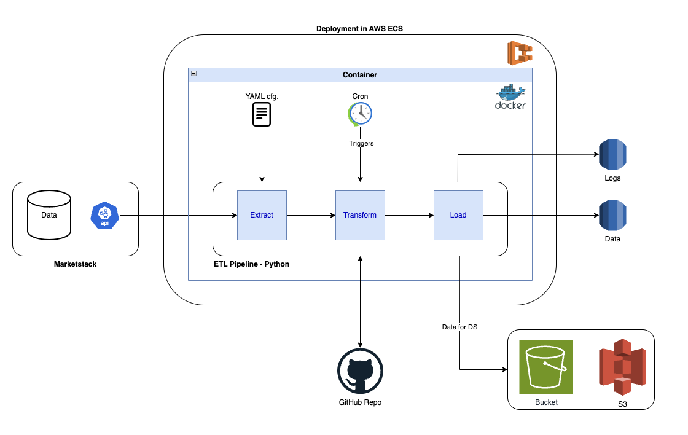

# Data Camp - Project 1

## Project Plan

### Objective
The project will gather stock data from a public API and make it available for consumption by Analysts.

### Consumers & Questions
The output dataset is thoroughly documented and can be easily accessed by authorized Data / Business Analysts either to do ad-hoc queries or connecting the corporate BI tool to provide meaningful insights to Investors. 
For this particular development, we aim to provide a dataset capable of tackling the following questions:
 - Which are the tickers that had the highest growth since Covid
 - What is the average growth for all the tickers during the same time frame
 - For the top tickers, what was their growth over the last 6 months and 1 year
This will help investors having an idea of the best commodities to invest in.

### Data Sources
Market indicators using the REST API suggested in the project definition will be used: **Marketstack API**.

### Architecture
The architecture that we defined as baseline for this project is:

This can be adapted during the project development considering new inputs and findings.

Please find below a high level description of each of the architecture blocks:
 - To connect to Marketstack, we will be using its REST API (https://marketstack.com/documentation).
 - ETL pipeline will be developed in Python, using OOP principles and structure studied during the course.
 - Girhub will be used for colaboration and code versioning. The Repor has beenn created as well as a branch for each of the developers.
 - The running python code will be later devloyed in a Docker image, ensuring we get a solution that is OS agnostic.
 - Docker image will then been deployed in AWS, using ECS.
 - DWH and Logs will be loaded into a RDS service in AWS.
 - In case of unstructured Data repository need, S3 will be used.
